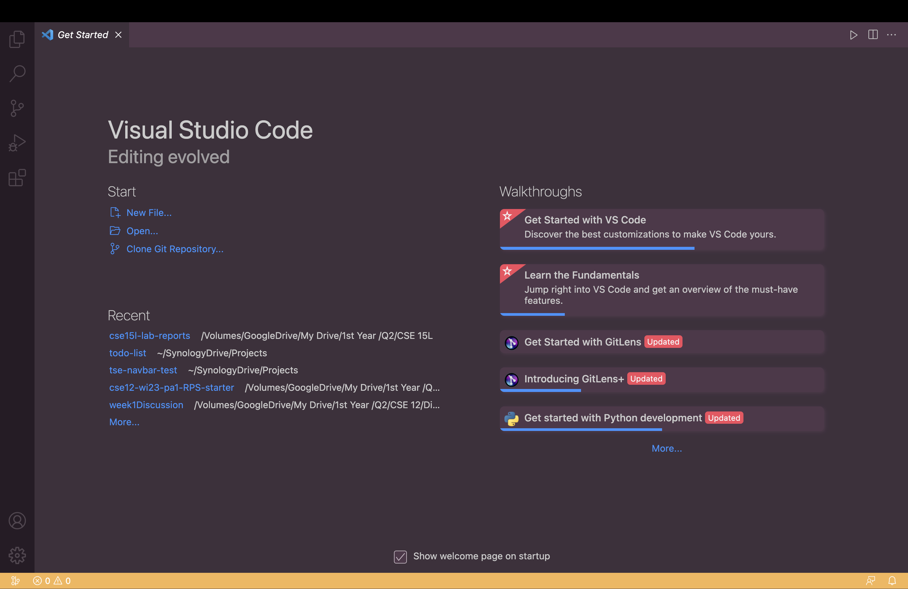
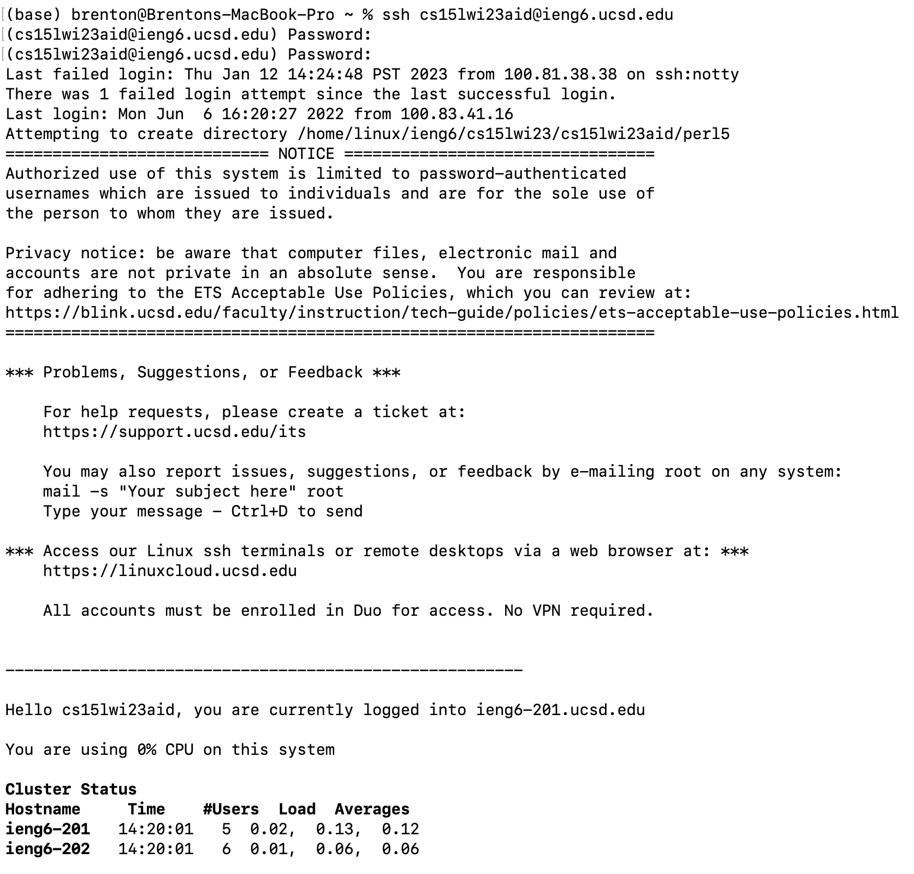
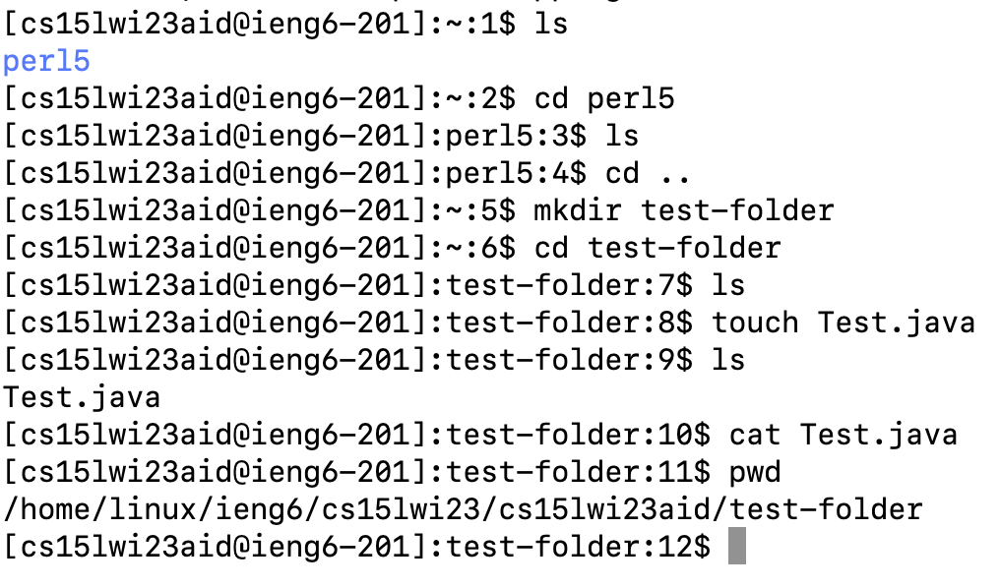

<h1>Lab Report 1</h1>

<h3>Installing VS Code</h3>

Visual Studio Code, or VS Code for short, is a source code editor owned by Microsoft. In order to download VS Code onto your own machine, first go to the VS Code download page [here](https://code.visualstudio.com/Download). Be sure to download the correct version for your operating system.


VS Code is already downloaded on my computer, so I did not have to do the download steps.

When you open VS Code, it should look like this: 

Note: the colors may be different.

<h3>Remotely Connecting</h3>
One may want to connect to a compouter remotely for a many reasons. For instance, the server computer (the computer the user is trying to connect to) may have more powerful resources than the client computer (the computer that the user is trying to connect with). 

</br>UC San Diego has its own server that you can connect to called `ieng6`. If you are in a course that needs to use `ieng6`, you will be given log-in credientials. It will usually be the course number followed by a unique set of characters. In order to access the server, you will use a protocol called the Secure Shell Protocol, or `SSH`.

For the Winter 2023 CSE 15L class, the user will type 
```ssh cs15lwi23__@ieng6.ucsd.edu```

where `__` is the unique set of digits assigned to you.

Once connected, you should see: 

You have successfully remotely connected to the UC San Diego `ieng6` server.

<h3>Trying Some Commands</h3>

Once you have connected to the `ieng6` server, you can run commands in the terminal. These commands will execute on the remote connection, not on your local computer.

Here are some useful commands:


| Syntax      | Description |
| ----------- | ----------- |
| cd [folder]      | change directory to [folder]      |
| cd ..     | change directory to the parent directory      |
| ls   | display files and subdirectories in current directory        |
| mkdir <dir\>     | make a directory named <dir\>       |
| touch <name\>.txt   | creates a file called <name\> with the extension .txt      |

Here is an example of commands that I did:



